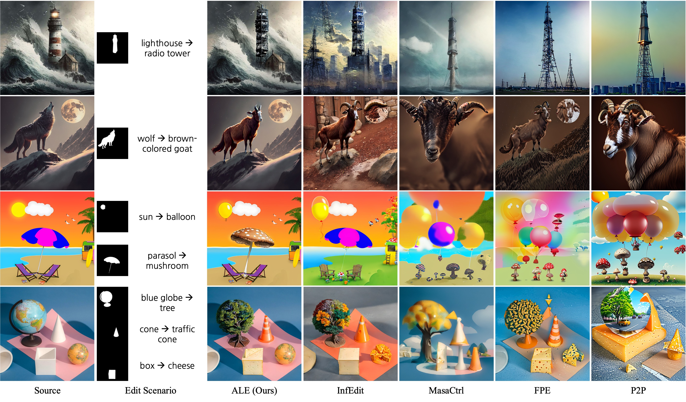
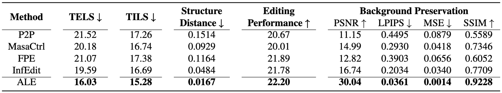

# 🧠 Attribute-Leakage-Free Editing (ALE)

**Official Implementation of [Addressing Text Embedding Leakage in Diffusion-based Image Editing (ICCV 2025)]**

ALE is a *training-free* image editing framework that prevents attribute leakage in text-guided diffusion-based editing.  
It is accompanied by **ALE-Bench**, a benchmark for evaluating attribute leakage in multi-object text-based image editing.

<p align="center">
  
</p>
<p align="center">
  <em>ALE performs lakage-free edits guided by text prompts, while prior methods show attribute leakages.</em>
</p>

---

## 📁 Project Structure

```
ale/                     # Core implementation of ALE
│
├── edit.py                  # Main editing pipeline
├── pipeline_ead.py          # Diffusion pipeline for editing
├── ore.py                   # Object-Restricted Embedding (ORE)
├── rgb_cam.py               # Region-Guided Blending for Cross-Attention Masking (RGB-CAM)
├── attention_control.py     # Background Blending (BB) and self-attention injection
├── sam_utils.py             # SAM-based segmentation utilities
├── config.py                # Configuration utilities
│
ale_bench/               # ALE-Bench benchmark dataset
│   ├── images/          # Source images
│   ├── masks/           # Object masks (for evaluation)
│   └── prompts/         # Source–target prompt pairs
│
evaluate/                # Evaluation scripts
│   ├── evaluate_ale.py       # Metric computation & statistics generation
│   └── metrics_calculator.py # Metric definitions (CLIP, PSNR, SSIM, LPIPS, etc.)
│
outputs/                 # SAM outputs
results/                 # Edited outputs generated by ALE
stats/                   # Evaluation results (CSV + XLSX)
│
ale_gradio.py            # Gradio demo interface
run_ale_bench.py         # Run ALE on ALE-Bench
README.md
.gitignore
```

---

## ⚙️ Installation

1️⃣ Create the Conda environment
```bash
conda env create -f environment.yaml
```
2️⃣ Install [Grounded SAM2]([https://github.com/facebookresearch/sam2](https://github.com/IDEA-Research/Grounded-SAM-2))

Follow the official [installation instructions](https://github.com/IDEA-Research/Grounded-SAM-2?tab=readme-ov-file#installation).

3️⃣ Activate the environment
```bash
conda activate ale
```


---

## 🚀 Usage

### 1️⃣ Run Gradio Demo

Launch the interactive editing interface:

```bash
python ./ale_gradio.py
```

This opens a **Gradio app** where you can:

* Load source images and masks
* Enter source and target prompts
* Perform localized, leakage-free text-guided editing

---

### 2️⃣ Run ALE on ALE-Bench

Automatically perform batch editing on the benchmark dataset:

```bash
python ./run_ale_bench.py
```

This script:

* Loads images, prompts, and masks from `ale_bench/`
* Runs the ALE pipeline
* Saves generated results under `./results/`

---

### 3️⃣ Evaluate Editing Results

Compute quantitative metrics and aggregate statistics:

```bash
python ./evaluate/evaluate_ale.py
```

This script:

* Loads edited results from `./results/`
* Computes metrics (TELS, TILS, Editing Performance, PSNR, SSIM, LPIPS, etc.)
* Saves:

  * `evaluation_results.csv`
  * Aggregated Excel summaries (`ale_mean_*.xlsx`)

All saved under the `./stats/` directory.

**Example output:**

```
stats/
├── evaluation_results.csv
├── ale_mean_per_target_count.xlsx
├── ale_mean_per_edit_type.xlsx
├── ale_mean_per_target_count_edit_type.xlsx
└── ale_mean_all.xlsx
```

---

## 📊 Metrics Overview

| Metric                                       | Description                                                               | Direction                  |
| -------------------------------------------- | ------------------------------------------------------------------------- | -------------------------- |
| **TELS**                                     | Target-External Leakage Score — leakage into background/unrelated regions | Lower is better            |
| **TILS**                                     | Target-Internal Leakage Score — leakage between different edited objects  | Lower is better            |
| **Editing Performance**                      | CLIP-based alignment between target prompts and edited regions            | Higher is better           |
| **PSNR / SSIM / LPIPS / Structure Distance** | Standard image similarity metrics                                         | Higher / Lower accordingly |

---

## 🎨 Results

<p align="center">
  
</p>
<p align="center">
  <em>ALE achieves faithful, localized, and leakage-free edits guided by text prompts.</em>
</p>

<p align="center">
  
</p>
<p align="center">
  <em>Qualitative comparison with existing editing methods.</em>
</p>


## 🧩 Citation

If you use **ALE** or **ALE-Bench**, please cite:

```bibtex
@InProceedings{mun2025ale,
    author    = {Mun, Sunung and Nam, Jinhwan and Cho, Sunghyun and Ok, Jungseul},
    title     = {Addressing Text Embedding Leakage in Diffusion-based Image Editing},
    booktitle = {Proceedings of the IEEE/CVF International Conference on Computer Vision (ICCV)},
    year      = {2025},
    url       = {https://arxiv.org/abs/2412.04715},
  }
```

---

## 📬 Contact

**Sunung Mun**
POSTECH AI Graduate School
📧 [mtablo@postech.ac.kr](mailto:mtablo@postech.ac.kr)


**Jinhwan Nam**
POSTECH AI Graduate School
📧 [njh18@postech.ac.kr](njh18@postech.ac.kr)

---

### 🙇‍♂️ Acknowledgements
This repository builds upon the open-source implementations of [InfEdit](https://github.com/sled-group/InfEdit) and [Prompt-to-Prompt](https://github.com/google/prompt-to-prompt).  

---

### 💡 ALE: Making diffusion-based image editing **faithful**, **localized**, and **leakage-free**.

